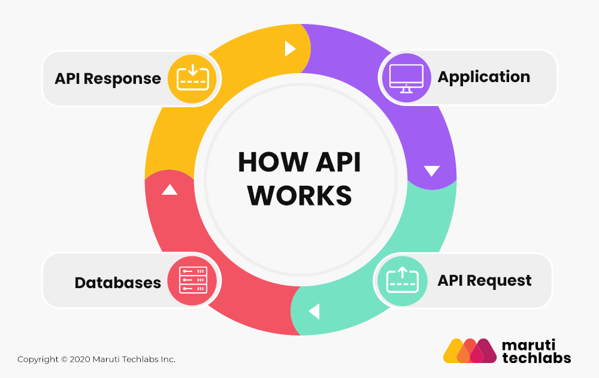

# High Level API Testing

## Testing Pipeline

We can summarize how an API works with this image

By knowing how it works at a high level we can now think about a way to test it:

* We have an application that provides some serivices
* We can send requests to this application
* The application interacts with a database
* The application sends back a reply

And it's on this reply that this documentation will focus: How can we assert that the replay we receive from a request is correct for us?

The pipeline that this documentation will follow is presented below:

* Test code is written with some programming language (like Javascript or Python or Java or Groovy)
* We upload test code on GitHub
* We build a pipeline in Jenkins in order to execute the test code making sure we have no errors

The topic of this documentation will be to show how to write Jenkins pipelines to send basic requests to an API